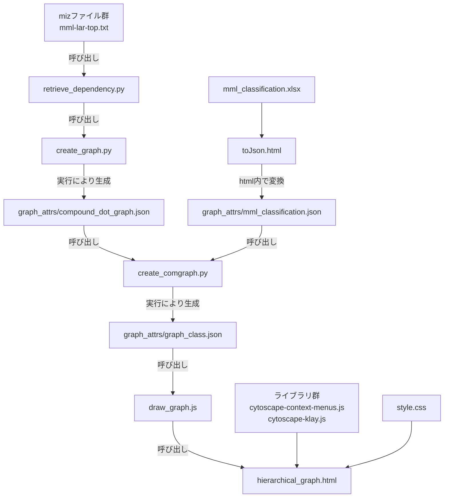

# emgraph2

compound_dot_graph.json作成時の留意点
 - pythonライブラリnetworkxをインストールする
 - create_graph.pyが存在するフォルダ内に2層のmml/2020-6-18(例、日付は適宜コピーした日に)フォルダを作成する
 - mizarをインストールし、MIZAR/mml下に存在する.mizファイル全てを日付フォルダ内へコピーする
 - 作成したmmlフォルダ内にmml-lar-top.txtファイルを作成し、  
グラフに描画したい(クラスタリングが完了した)article名を1行ずつ書き込む  
 - 作成した.txtファイルと日付フォルダはretrieve_dependency.pyのグローバル変数articleListとmmlDirectoryで読み取られるため    
 ファイル名の変更を行った場合、それぞれのグローバル変数の値を書き換える  
 - 上記の手順の後、create_graph.pyを実行することでcompound_dot_graph.jsonが作成される

mml-lar-topファイル内の様式(一部)
```
tarski
xboole_0
boole
xboole_1
enumset1
```

