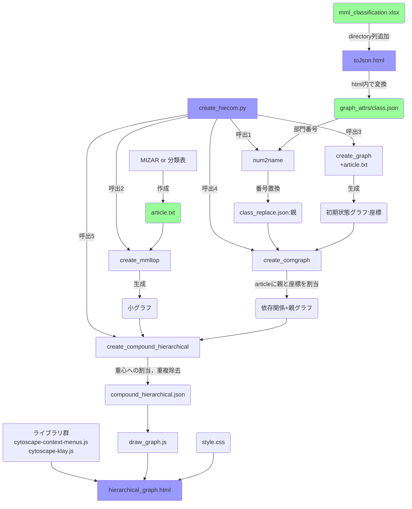

# emgraph2
step1．  
分類表に部門項目をまとめた**列directory**を作る  
例：23/12時点の分類表の場合，AH列などに「**="/"&Ni&Oi**」(iはそれぞれの行数)を作る．  
ただし同表はMSCのdirectory列が既にあるので，MSC側の列名も変える．

step2.
分類表を**toJsonで変換**し，graph_attrs下にjson形式で保存(**class**と呼称)  
※この時mml-nameが"2001-11-30T15:00:00.000Z"になるアーティクルがあったり，  
不要な改行でjson形式になっていないケースがあったのでjson内の要確認

{"mml_classification":[{"mml-name":"article1", "directory":"/divisionItem"},{"mml-name":"article2", "directory":"/divisionItem"},{...}]}  
こういう感じの形式のjsonにする(mml-name,directory以外のキーが残っていてもよいが，分類済みのアーティクルのみのリストにする)  
  
step3.   
分類表などからmml/miz_list下にアーティクル名を格納した.**txtファイルを作る**．(**article**と呼称)  
凡例
```
tarski
xboole_0
boole
xboole_1
```
※create_hiecom.pyの21行目「create_graph.create(省略)｣を
create_mmltop.create_all_graph(dep_only_graphname)に書き換えると  
mml/mizafile内の.mizファイルから自動で.txtファイルが作成される，  
が，このファイル内の順序も最終的な配置に影響するので，分類表をmml-order順に並べてコピペする方が安定したグラフになりやすい．

step4.  
compound_graph下のcreate_hiecom.pyを実行する  
class，article，出力ファイルの名前が要求されるので適宜入力
